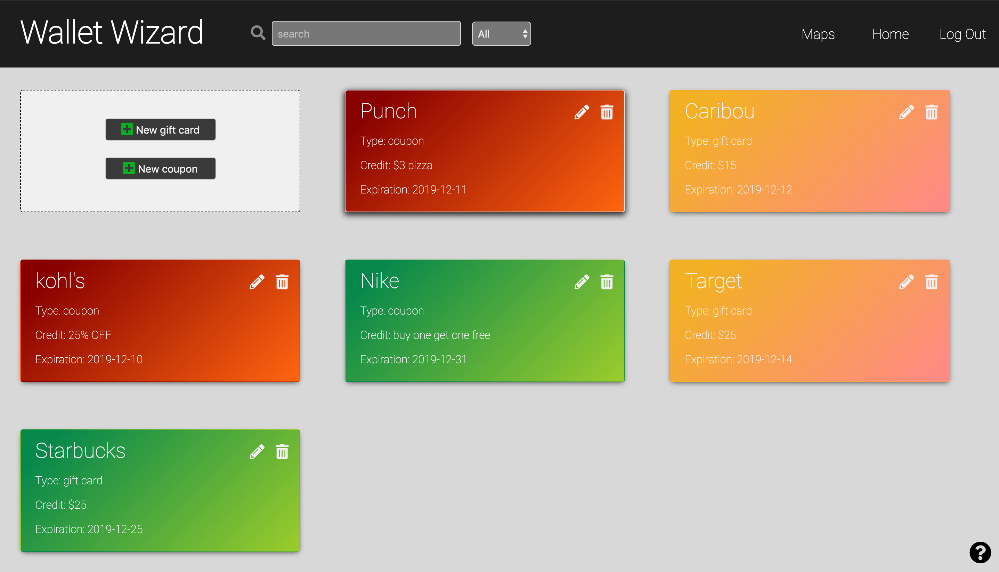
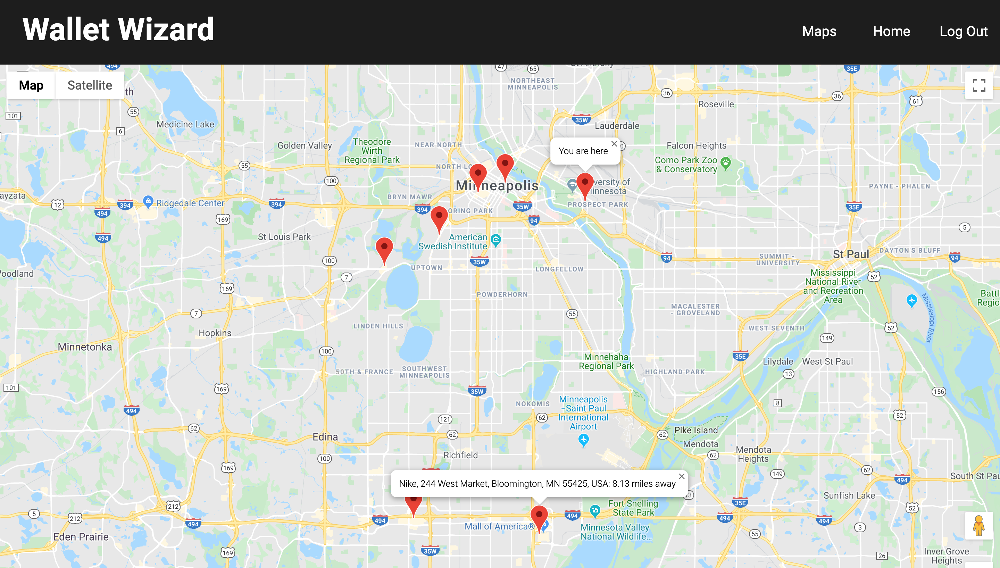
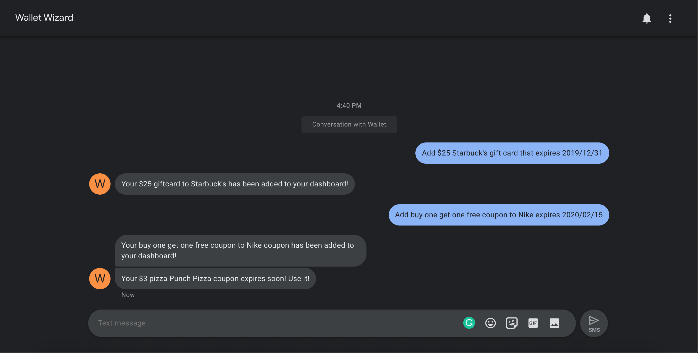

# Wallet Wizard

## Description

Wallet Wizard is a full-stack web application that provides users with a tool to let them keep track of and utilize their coupons and gift cards. Users can use SMS after signing up, to add gift cards to their dashboard and automatically get reminders texted to them before they expire to remind the user to use them. Users can also view a google-maps window which will show them nearby location which they have gift cards or coupons to.

## Installation

    Clone Repo
    - npm install
    - npm run server
    - npm run client

## Technologies

    - React
    - Redux
    - Redux Sagas
    - Node
    - Express
    - PostgreSQL
    - Twilio
    - Google Maps API
    - Geo Location API